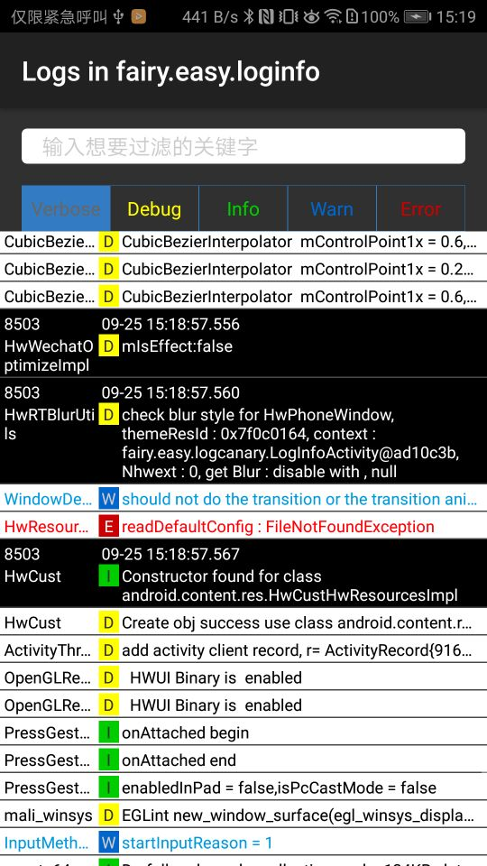
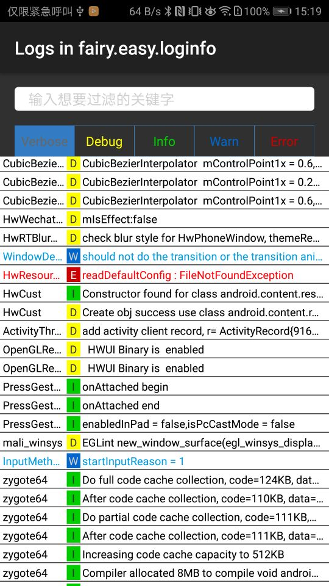

<div align="center">

## LogCanary

**`Android`Log日志打印输出**

[ ](https://bintray.com/guxiaonian/logcanary/logcanary/_latestVersion)
[](https://github.com/guxiaonian/LogCanary/issues)
[](https://github.com/guxiaonian/LogCanary/network)
[](https://github.com/guxiaonian/LogCanary/stargazers)
[](http://www.apache.org/licenses/LICENSE-2.0)

</div>
<br>

# 效果展示




# 依赖

```gradle
debugImplementation  'fairy.easy.logcanary:logcanary:{latestVersion}'
releaseImplementation  'fairy.easy.logcanary:logcanary-no-op:{latestVersion}'
//androidX使用
//debugImplementation  'fairy.easy.logcanary:logcanary-androidx:{latestVersion}'

```
      
# 调用方式

```java
public class App extends Application {

    @Override
    public void onCreate() {
        super.onCreate();
        LogCanary.install(this);
    }
}

```
